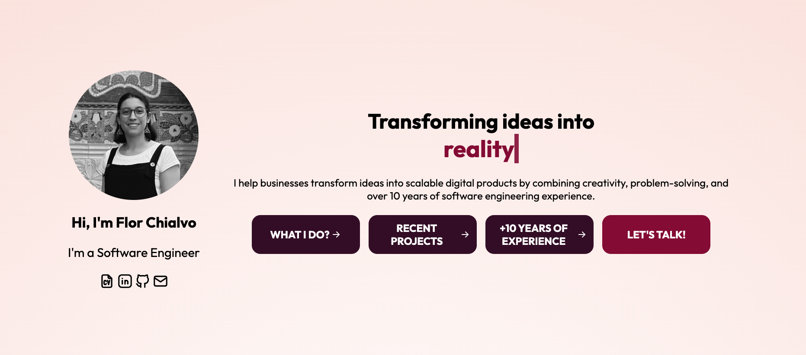
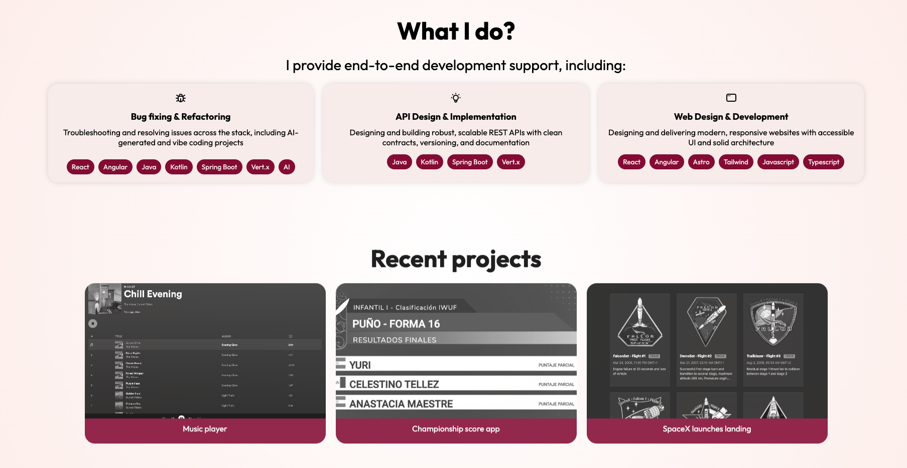
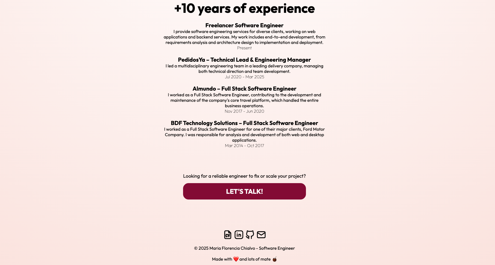

# About me - Portfolio Website

This is a personal portfolio website showcasing my skills and experience as a software engineer.

## Overview

The site includes:

- A responsive design that works on all devices (mobile, tablet, desktop)
- Sections for introduction, services offered, projects showcase, experience timeline, and contact information
- Interactive elements with smooth scrolling navigation

## Design & Development Details:
- HTML5/CSS3 structure with modern styling
- Responsive layout using CSS
- Smooth animations for a polished user experience

## Screenshots

Here are some images of the portfolio site:

## Contact

For any inquiries, please reach out via:

- Email: mf.chialvo@gmail.com
- LinkedIn: [LinkedIn Profile](https://www.linkedin.com/in/maria-florencia-chialvo-75b77b143/)
